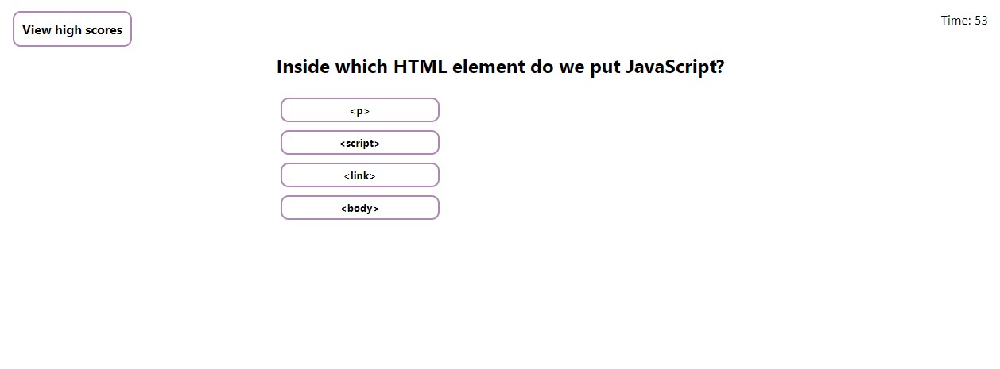

# 04-code-quiz

## Description

A timed javascript knowledge quiz with a highscore system

## Usage

View this web application at:

https://adzy404.github.io/04-code-quiz/

Press 'start quiz' and click your answer for each question, you will have 60 seconds to complete the quiz. There are a total of 10 questions, each correct answers gives you 1 point and any incorrect answers deduct 5 seconds of your time. 

## License

MIT License